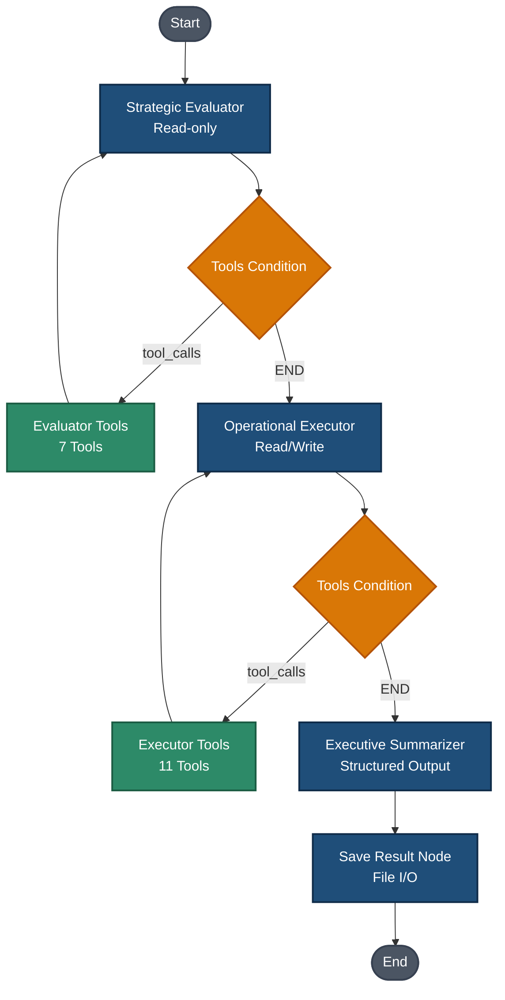

# Nadeem-MAS

### A Graph-Based Multi-Agent System for Autonomous Task Management

---

## 🚀 Introduction & The NADEEM Concept

**Nadeem-MAS** is a graph-based multi-agent system designed to bridge the gap between passive static planning and intelligent, reactive execution. The acronym **N.A.D.E.E.M.** stands for **N**otion-integrated **A**gents for **D**aily **E**valuation, **E**xecution, and **M**anagement.

In personal productivity systems, users often struggle with the disconnect between high-level goals (e.g., in a Notion planner) and the actual friction of daily, atomic execution. **Nadeem-MAS** solves this by establishing an autonomous, cyclical multi-agent loop that reads historical progress and current strategic goals, reasons about the gap, dynamically invokes Notion APIs to orchestrate atomic tasks, and summarizes execution state to preserve continuous cross-session memory.

---

## 🧠 Architecture

Built on **LangGraph**, the system utilizes a specialized multi-agent topology to enforce separation of concerns, optimize token usage, and guarantee runtime safety. Unlike single-agent architectures that rely on large, monolithic prompts, **Nadeem-MAS** distributes responsibilities across three dedicated node types.

### Workflow Diagram

The runtime flow is managed by a stateful directed acyclic graph (DAG) utilizing conditional edges for agentic ReAct loops:



### Agent Nodes & Responsibilities

1. **Strategic Evaluator (Read-only)**
   - **Role:** Analyzes the broader strategic context (monthly/weekly goals) and performance history, then sets the operational direction.
   - **Operations:** Read-only access to Notion databases.
   - **Context Retrieval:** Evaluates the user's manual inputs, specific goals, and reads the technical context file saved from the previous day's run (`get_yesterday_context`).
   - **Output:** Generates a structured analysis (situation summary, past performance review, new goals evaluation, and direct personal growth insights) along with a **Strategic Compass** directive. Crucially, the Evaluator does not generate specific tasks; it defines *what* needs to be achieved, leaving the *how* to the Executor.

2. **Operational Executor (Read/Write)**
   - **Role:** Receives the Strategic Compass directive and translates it into specific, atomic, actionable tasks in Notion.
   - **Operations:** Read, write, update, and delete access.
   - **Execution Loop:** Utilizes a ReAct loop to iteratively discover, create, update, or archive Notion tasks. 
   - **Safety Rails:** Strictly forbidden from deleting or editing tasks manually created by the user (`Abdulaziz Aws`), facilitating human-AI alignment instead of destructive overwrites.

3. **Executive Summarizer (Structured Output)**
   - **Role:** Consolidates the conversation logs and API states into clean, structured schemas.
   - **Operations:** Does not use tools.
   - **Structured Schema:** Uses Pydantic `.with_structured_output(DailySummaryOutput)` to enforce two distinct, separate outputs:
     * `morning_briefing`: A formatted Markdown summary in Arabic designed for the user, summarizing operations, evaluator advice, and a daily productivity tip.
     * `system_context`: A dense, highly technical summary in English outlining the current system state, warnings, bottlenecks, and tasks assigned. This file acts as the primary feed for tomorrow's **Strategic Evaluator**, ensuring cross-session continuity.

---

## ✨ Key Features

- **Advanced Token Optimization (~85-90% Reduction):** Raw payloads from the Notion API contain dozens of fields, inflating the context window. By parsing the response through a custom Pydantic `AgentTask` validator on the fly, redundant metadata is stripped away, reducing context size by ~85-90% and preserving LLM context.
- **Robust State Management:** Implements LangGraph `AgentState` with `operator.add` reducers on key accumulative lists (e.g., `messages`). This prevents agents from overwriting downstream modifications and ensures step-by-step trace integrity.
- **LLM Fallback Strategy:** Configured to bound cost and optimize performance. In case of API rate limits or network issues, the system utilizes a robust fallback architecture:
  * **Primary:** Google `gemini-3.5-flash` (balanced creativity and tool accuracy).
  * **Fallback:** Google `gemini-3-flash-preview` (high-speed fallback).
- **Cross-Session Memory Persistence:** Solves the standard LLM state-reset problem by writing session summaries (`system_context`) to file-based logs organized dynamically by `data/guidelines/{year}/{month}/context_{timestamp}.md`. The Evaluator automatically pulls the latest file at startup, creating an unbroken thread of memory across daily boundaries.
- **Bi-directional User Loop:** The saved context file contains a dedicated section for users to write manual inputs, feedback, or excuses overnight. When the system boots up next morning, it parses these comments to adjust its scheduling.

---

## 🛠️ Tech Stack

- **Python (>=3.14):** Core programming language.
- **LangGraph (>=1.2.0):** State management framework for constructing cycles and conditional branches.
- **LangChain (>=1.3.0):** LLM integration, prompt templates, and tool abstractions.
- **Google Gemini API (`gemini-3.5-flash` & `gemini-3-flash-preview`):** Primary language reasoning.
- **Notion Client (REST API):** Database storage and tasks workspace.
- **Tavily Search API (>=0.7.25):** External web-search engine for strategic validation and fact checking.

---

## ⚙️ Getting Started

### Prerequisites

- **Python 3.14** (or higher) installed.
- A **Notion Integration Token** and an associated **Database ID** for task management.
- API keys for Google Gemini and Tavily Search.

### Directory Structure

```
my_assistant/
├── src/
│   ├── agents/           # Agent definitions and Graph topologies
│   │   ├── agent_state.py        # TypedDict Shared AgentState
│   │   ├── assistant_agent.py    # LangGraph construction and compilation
│   │   ├── evaluator.py          # Strategic Evaluator node
│   │   ├── executor.py           # Operational Executor node
│   │   └── summarizer.py         # Executive Summarizer node
│   ├── core/             # Core reasoning algorithms
│   ├── tools/            # Integration tools
│   │   ├── notion_tools.py      # Notion CRUD functions and wrapper
│   │   └── search_tavily.py     # Tavily Search engine wrapper
│   ├── schemas/          # Pydantic schemas for data sanitization
│   │   ├── agent_task.py        # Notion task filter schema & token optimizer
│   │   └── daily_summary_output.py # Pydantic structured output models
│   └── utils/            # Shared utilities (logger, yesterday context retriever)
├── config/
├── data/                 # Session persistent directory
│   ├── feedback/         # User morning briefings (.md)
│   ├── guidelines/       # System context continuity logs (.md)
│   └── memory/           # Notion DB mapping metadata (master.json)
├── main.py               # Main execution script
└── pyproject.toml        # Dependency definition file
```

### Environment Variables

Configure a `.env` file in the project root containing the following variables:

```env
# LLM Provider API Keys
GEMINI_API_KEY=your_gemini_api_key_here
GROQ_API_KEY=your_groq_api_key_here
OPENAI_API_KEY=your_openai_api_key_here

# Tool & Service Integrations
TAVILY_API_KEY=your_tavily_search_api_key_here
NOTION_ACCESS_TOKEN=secret_your_notion_integration_token_here

# LangSmith Observability (Optional)
LANGSMITH_TRACING=true
LANGSMITH_ENDPOINT=https://api.smith.langchain.com
LANGSMITH_API_KEY=your_langsmith_api_key_here
LANGSMITH_PROJECT=Nadeem-MAS
```

### Setup & Installation

This project uses [uv](https://github.com/astral-sh/uv) as the primary package manager for blazingly fast dependency management and environment isolation.

1. **Clone the Repository:**
   ```bash
   git clone [https://github.com/your-username/nadeem-mas.git](https://github.com/your-username/nadeem-mas.git)
   cd nadeem-mas
   ```

2. **Set up a Virtual Environment (using uv):**

   **Use uv to create a virtual environment blazingly fast:**
   ```bash
   uv venv
   # Windows PowerShell:
   .\.venv\Scripts\Activate.ps1
   # macOS/Linux:
   source .venv/bin/activate
   ```

3. **Install Dependencies:**

   **Install in editable mode using uv pip for maximum speed:**
   ```bash
   uv pip install -e .
   ```
   Or install requirements directly:
   ```bash
   uv pip install gradio langchain langchain-community langchain-core langchain-google-genai langchain-groq langchain-ollama langchain-openai langchain-openrouter langgraph langgraph-api langgraph-cli pillow python-dotenv tavily-python
   ```

4. **Initialize Notion Master Mapping:**
   Ensure you configure the target Notion Database ID inside `data/memory/Monthly-planner-2026/master.json`:
   ```json
   {
     "metadata": {
       "master_tasks_db_id": "your_actual_notion_database_uuid"
     }
   }
   ```

5. **Run the System:**
   Execute the daily workflow cycle via the main entrypoint:
   ```bash
   uv run main.py
   # (uv run automatically ensures the correct environment is used)
   ```

---

## 👨‍💻 Author

**Abdulaziz Aws**
- Lead Developer & Project Architect
- Dynamic automation explorer & AI enthusiast.